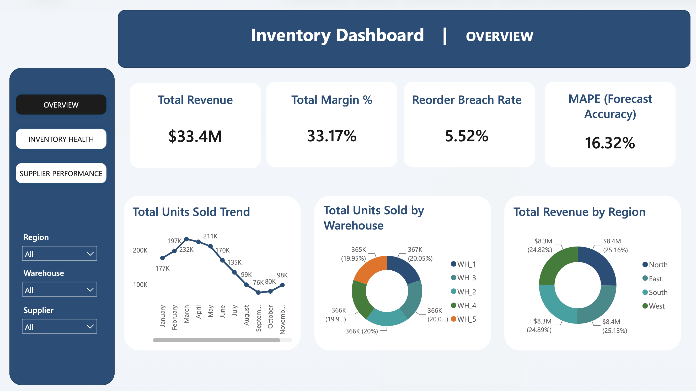
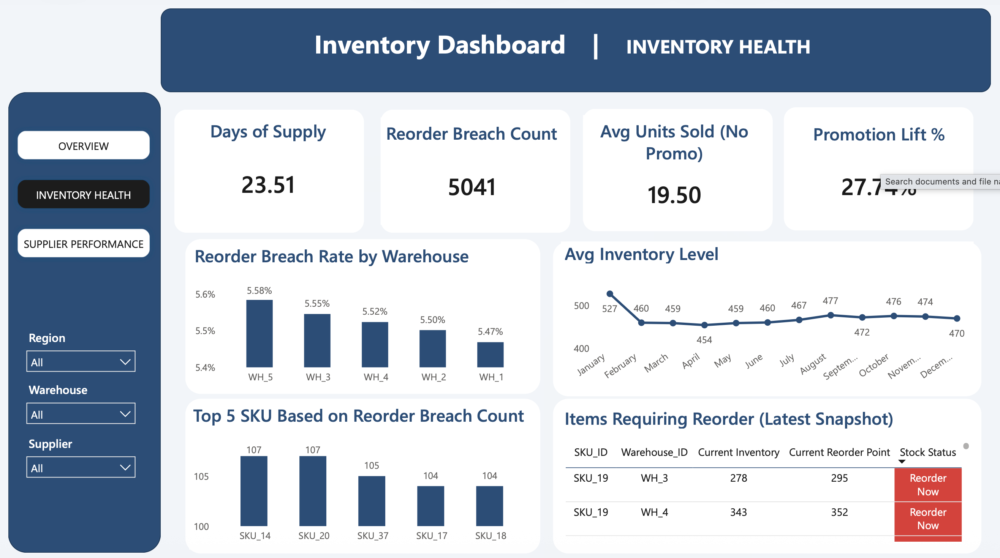
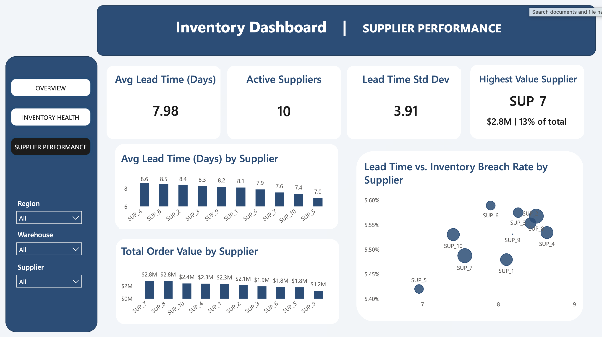

# Inventory Analytics Dashboard — Azure SQL + Power BI

<div align="left">
  
  
  
  
</div>

<br>

An end-to-end inventory analytics project analyzing a full year of SKU-level sales, inventory, and supplier data across 5 warehouses and 4 regions.

Built with a **Python → Azure SQL → T-SQL → Power BI** pipeline, using a clean star schema and a focused 3-page interactive dashboard.


---
## Key Insight

**Inventory replenishment responds to reorder-point breaches with a consistent one-day lag.**

When inventory level falls below the reorder point, a replenishment order almost always appears the following day.

- **5,041** reorder-breach events were identified
- **5,027** of them were followed by a positive `order_quantity` the next day
- The remaining **14** breaches occurred on the final day of the dataset (30 Dec 2024), so no subsequent day exists to observe the order

This shows that the replenishment process is **reactive** and operates with a fixed one-day delay. 

---

## Tech Stack

| Layer                             | Tool                          |
|-----------------------------------|-------------------------------|
| Data prep & feature engineering   | Python (pandas, numpy)        |
| Database                          | Azure SQL Database            |
| Transformation & modeling         | T-SQL                         |
| Visualization                     | Power BI                      |
| Development environment           | VS Code (Jupyter + MSSQL)     |

---

## Dataset

### Dataset
This project uses the [High-Dimensional Supply Chain Inventory Dataset](https://www.kaggle.com/datasets/ziya07/high-dimensional-supply-chain-inventory-dataset) sourced from Kaggle:

- **91,250** rows
- **15** source columns
- Daily transactions for a full calendar year (Jan 1 – Dec 30, 2024)

| Dimension  | Count |
|------------|-------|
| SKUs       | 50    |
| Warehouses | 5     |
| Suppliers  | 10    |
| Regions    | 4     |

No missing values or duplicate records were found in the raw source data.


## Data Quality Findings and Engineering Decisions

A structured EDA pass was performed before any modeling. Key findings:

1. **The  `stockout_flag` remained at `0` across all rows of the dataset**  
        This indicates that inventory levels were successfully maintained with zero stockouts during the observed period.

   
2. **Replenishment follows reorder breaches with a one-day lag**  
        To gain deeper operational insights beyond just looking at stockouts, new feature was  engineered to track when inventory levels dropped below the safety threshold (`reorder_breach = inventory_level <= reorder_point`), highlighting critical moments where replenishment orders should have been triggered.


3. **Forecast accuracy is unbiased but noisy**  
   - Mean forecast error ≈ 0 
   - MAPE ≈ 16.3%  

4. **Warehouse and Region are independent dimensions**  
   Every warehouse shipped to all 4 regions in roughly equal volume.  
   → Modeled as two separate dimension tables.

5. **`order_quantity` is zero in ~94% of rows**  
Confirmed as expected behavior (orders only occur on specific replenishment events).

## Architecture

```text
Raw CSV (91,250 rows)
        ↓
Python (cleaning, feature engineering, quality checks)
        ↓
stg_inventory (Azure SQL)
        ↓
T-SQL (star schema construction + data quality tests)
        ↓
DimDate · DimSKU · DimWarehouse · DimSupplier · DimRegion · FactInventory
        ↓
Power BI (DAX measures + interactive dashboard)
```

### Design Decisions

- Classic **star schema** with surrogate keys (`INT IDENTITY`)
- Fact grain: one row per `(Date, SKU, Warehouse)` — confirmed unique
- `DimDate` generated via recursive CTE (full calendar, not just existing dates)
- Idempotent SQL scripts for safe re-runs
- Explicit indexes on all foreign keys in the fact table
- Staging → Marts pattern (Python loads staging, T-SQL builds the dimensional model)

### Engineered Fields

| Field            | Logic                              | Purpose                        |
|------------------|------------------------------------|--------------------------------|
| `reorder_breach` | `inventory_level <= reorder_point` | Working stockout indicator     |
| `forecast_error` | `demand_forecast - units_sold`     | Forecast bias                  |
| `abs_pct_error`  | `\|forecast_error\| / units_sold`  | Forecast accuracy (MAPE-style) |
| `margin`         | `unit_price - unit_cost`           | Profitability                  |
| `margin_pct`     | `margin / unit_price`              | Margin percentage              |

### Data Quality Tests

All tests follow a **zero-rows-on-success** pattern:

- Row count parity between `stg_inventory` and `FactInventory`
- Orphan checks against all five dimension tables
- Grain uniqueness check on `(DateKey, SKUKey, WarehouseKey)`
- Business logic checks (no negative inventory, cost ≤ price, etc.)


## Dashboard Screenshots

  
  



## How to Reproduce

1. Create an Azure SQL Database (free tier works)
2. Run `notebooks/Inventory.ipynb` to prepare the raw CSV and load it as `stg_inventory`
3. Run the SQL scripts in `/sql` in numeric order to build the star schema
4. Run `05_data_quality_tests.sql` and confirm all checks return zero rows
5. Open `power_bi/inventory_dashboard.pbix`, update the Azure SQL connection string, refresh


## License
This project is licensed under the MIT License.


